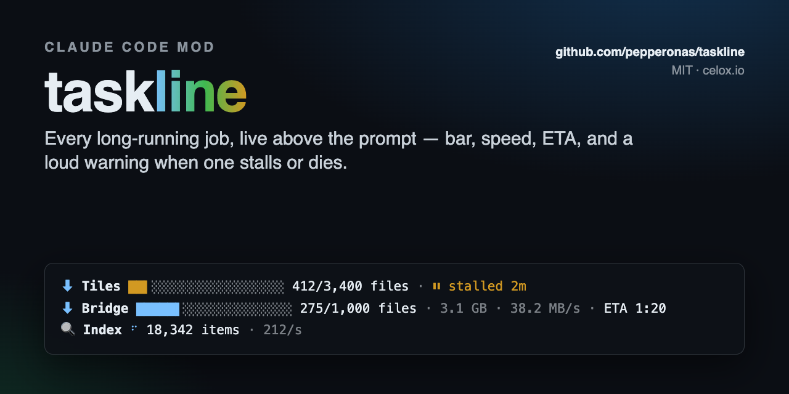
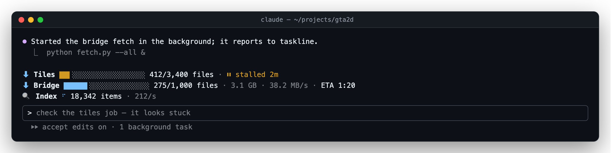
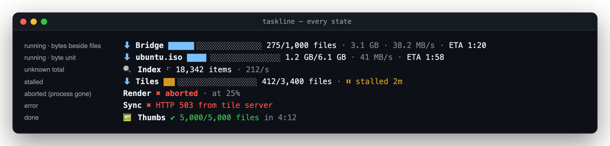
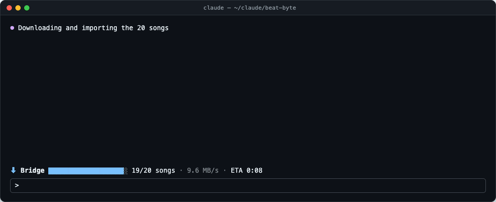
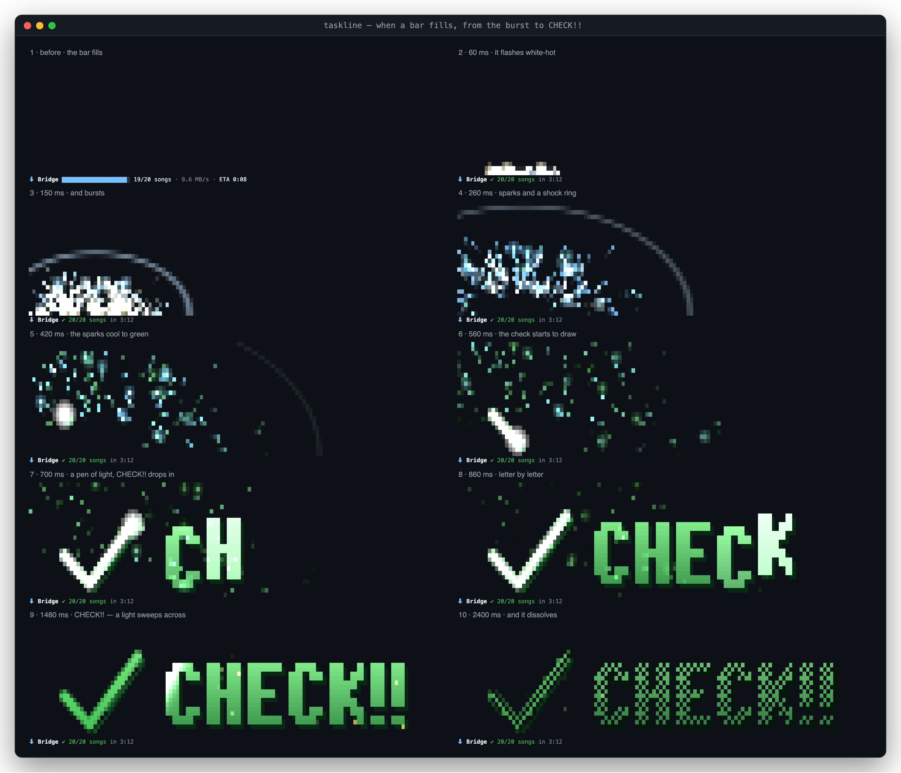
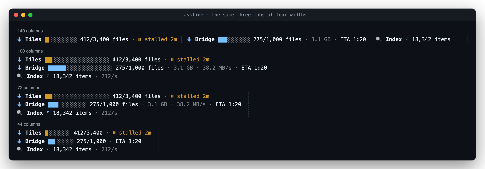

<div align="center">

<a href="https://github.com/pepperonas/taskline"></a>

# ⏳ taskline

**A Claude Code mod that shows every long-running job — downloads, fetches, renders, imports — as a live progress line right above the prompt: bar, count, size, speed, ETA, and a loud warning when something stalls or dies.**

<p>
  <a href="#-install"></a>
  &nbsp;
  <a href="#-report-progress-from-your-jobs"></a>
</p>

<h3>👉 <code>/plugin marketplace add pepperonas/taskline</code> · <code>/plugin install taskline@pepperonas-taskline</code></h3>

[](CHANGELOG.md)
[](tests)
[](hooks)
[](tests/test_taskline.py)

[](https://github.com/pepperonas/taskline/actions/workflows/ci.yml)
[](https://code.claude.com/docs/en/plugins/mods/overview)
[](#requirements)
[](https://www.typescriptlang.org)
[](python/taskline.py)
[](package.json)
[](PROTOCOL.md)
[](#-how-it-works)
[](#-privacy)
[](#-testing)
[](CHANGELOG.md)
[](https://semver.org)
[](#-contributing)
[](LICENSE)

[](https://www.paypal.com/donate/?business=martin.pfeffer@celox.io&currency_code=EUR&item_name=taskline)
[](https://g.page/r/CXgdRV3QysvxEBM/review)

</div>

> [!NOTE]
> You start a 3 GB download in another terminal, ask Claude something else, and twenty minutes later wonder whether the download is still alive. taskline answers that without you leaving the conversation: every job that reports in shows up above the prompt, keeps its ETA honest, turns **yellow** when it stops moving and **red** when its process is gone.

## 📸 Screenshots

**In a session** — a stalled job, a download with files and bytes, and an open-ended index, right above the prompt:



**Every state** — a running job with files *and* bytes, a byte-sized download, an unknown amount of work, a stall, a crashed writer, an error, and a finished job (green for ten seconds, then gone):



**When a bar fills** — it bursts into sparks out of the bar's own position, a shock ring runs out, a check mark draws itself with a pen of light, **CHECK!!** drops in letter by letter, a light sweeps across, and it all dissolves (≈ 3 s, 30 fps, every frame below is the mod's own output):



The whole run frame by frame, from the full bar to CHECK!!:



**Width-aware** — the same three jobs at 140, 100, 72 and 44 columns. One line while everything fits richly; otherwise one row per job, each shrinking its bar first, then its extras, then its label. Nothing ever wraps:



All images, the social card included, are rendered by [`tools/screenshots.ts`](tools/screenshots.ts) from the mod's own layout code, not drawn by hand.

## ✨ Features

- **One line for everything that runs** — any number of jobs from any project, one row above the prompt, problems first.
- **Real ETA** — an exponentially smoothed speed (time constant 20 s) sampled at each job's *own* update time, so polling an unchanged file never drags the estimate down, and the countdown keeps ticking between updates.
- **Bytes beside files** — `275/1,000 files · 3.1 GB · 38.2 MB/s`: count in files, measure in bytes; the ETA uses whichever total is known.
- **Unknown totals** — a spinner, the count and a rate instead of a bar.
- **Stall detection** — no update for 60 s (configurable) → `⏸ stalled 2m` in yellow.
- **Crash detection** — a job that names its `pid` and dies without saying so shows `✖ aborted`, in red.
- **Errors stick** — a failed job stays red with its message until you clear it (or an hour passes).
- **Done fades** — green `✔` with the elapsed time for ten seconds, then the file is cleaned up.
- **A finish worth watching** — when a running bar fills, it explodes into sparks and a big green check with **CHECK!!** plays above the band: a truecolor pixel canvas (two pixels per cell), repainted in place at 30 fps, see-through where nothing glows. Compact below 107 columns, one `✔ CHECK!!` line when even that does not fit, on the desktop app, or with animation off. `/taskline check` plays it on demand.
- **Width-aware, never wraps** — shorter bar → fewer extras → shorter label → `+N more`.
- **Watchers for jobs that report nothing** — a file growing to a known size, the last `[275/1000]` in a log, files piling up in a folder.
- **A one-file protocol** — any language can report: write JSON, rename. A Python helper and a `taskline` CLI do it for you.
- **Safe by construction** — strings are stripped of control characters (no ANSI injection from a log), ids are path-safe, a broken file costs only itself, nothing reaches the network.
- **`NO_COLOR` respected**, plus a color switch in `/config`.

## 📥 Install

### Requirements

- **Claude Code 2.1.289 or newer** with mods (function-hook plugins). Tested on 2.1.289, terminal and desktop.
- For the reporting helpers: **Python 3.8+** (standard library only). The protocol itself needs nothing.

### Option 1 — the mod from the marketplace

```text
/plugin marketplace add pepperonas/taskline
/plugin install taskline@pepperonas-taskline
```

Then, for your jobs, the Python helper and the CLI:

```bash
pip install git+https://github.com/pepperonas/taskline     # in a venv, or with --user
taskline --help
```

### Option 2 — clone and run the installer

```bash
git clone https://github.com/pepperonas/taskline && cd taskline
./install.sh              # mod + Python helper + CLI; --no-mod for just the helpers
```

`install.sh` creates `~/.claude/progress/` and `~/.claude/taskline/watchers.json`, links the `taskline` CLI into `~/.local/bin`, makes `import taskline` work for your `python3` (a `.pth` file in the user site-packages), and installs the mod from this folder as a local marketplace. It never edits `settings.json` itself — the plugin CLI does that — and it records what it did, so **`./uninstall.sh` undoes exactly that** (`--purge` also deletes your progress files and watchers). Both take `--dry-run`.

> Projects with their own **virtualenv** don't see the user site-packages. Inside the venv: `pip install -e /path/to/taskline` — or just copy [`python/taskline.py`](python/taskline.py); it is one file.

### Option 3 — try it for one session

```bash
claude --plugin-dir /path/to/taskline
```

## 📡 Report progress from your jobs

### Python

```python
from taskline import Progress, track

# a context manager: done on success, error (with the exception) on failure, interrupted on Ctrl+C
with Progress("bridge", total=1000, label="Bridge", unit="files", icon="⬇") as p:
    for url in urls:
        size = fetch(url)
        p.advance(add_bytes=size)        # count a file, add its bytes

# or wrap any iterable
for tile in track(tiles, "tiles", label="Tiles", unit="files"):
    render(tile)
```

A job that reports rarely (once per batch) passes `stalled_after=600` so the gaps don't read as stalls. `Progress` writes at most once a second (always the first and the last state), records its own `pid` so a crash shows as *aborted*, and **never raises into your job** — a full disk costs the display, not the download. One-shot calls are there too: `report(id, done, total, ...)`, `finish(id)`, `fail(id, message)`, `remove(id)`.

### Shell

```bash
taskline set backup 0 120 --label Backup --unit files --pid $$
for f in data/*; do
  rsync -a "$f" nas:/backup/ && taskline add backup
done
taskline done backup              # or: taskline fail backup "nas unreachable"
```

Pass **`--pid $$`** — the CLI process itself exits immediately, your script's pid is what should be watched. Sizes take suffixes (`--bytes 3.1G`), an unknown total is `-`.

| Command | What it does |
|---|---|
| `taskline set <id> <done> [total]` | report progress (`--label --unit --icon --message --bytes --bytes-total --pid --stalled-after`) |
| `taskline add <id> [n]` | add `n` (default 1), `--bytes` adds bytes |
| `taskline done <id>` | mark done (fills a known total) |
| `taskline fail <id> [message]` | mark failed |
| `taskline rm <id>...` | remove tasks |
| `taskline clear [--all]` | remove finished, failed and aborted tasks (`--all`: stalled too) |
| `taskline ls [--json]` | list tasks |
| `taskline dir` | print the progress directory |

### Any other language

Write `~/.claude/progress/<id>.json` atomically (temp file in the same folder, then rename) — see **[PROTOCOL.md](PROTOCOL.md)**:

```json
{ "v": 1, "label": "Bridge", "done": 275, "total": 1000, "unit": "files",
  "status": "running", "updated_at": 1759700123.4, "pid": 4242 }
```

Worked examples for a real Python batch download and a Node fetch script: **[docs/INTEGRATIONS.md](docs/INTEGRATIONS.md)**.

### Jobs that report nothing: watchers

`~/.claude/taskline/watchers.json` (examples in [`examples/watchers.json`](examples/watchers.json)):

```json
{
  "watchers": [
    { "type": "filesize", "label": "ISO",   "path": "~/Downloads/big.iso", "total_bytes": "6.1 GB" },
    { "type": "logtail",  "label": "Fetch", "path": "~/proj/fetch.log",
      "pattern": "\\[(?<done>[\\d,]+)/(?<total>[\\d,]+)\\]", "unit": "files" },
    { "type": "dircount", "label": "Thumbs", "path": "~/site/thumbs", "glob": "*.{webp,png}", "total": 5000 }
  ]
}
```

| Field | Types | Meaning |
|---|---|---|
| `type` | all | `filesize`, `logtail` or `dircount` |
| `path` | all | file, log or folder; `~` works. For filesize and logtail the file name may be a glob (`~/w/fetch*.log`): the most recently modified match is read, so a new run's log takes over by itself |
| `label`, `icon`, `id`, `unit` | all | display; `id` defaults to the file name |
| `total` | all | expected count (a `total` group in the log wins) |
| `total_bytes` | filesize, logtail | expected size, `"6.1 GB"` or a number |
| `pattern` | logtail | regex with a `(?<done>…)` group, optional `total`, `bytes`, `bytes_total`, `message`; Python's `(?P<name>…)` works too; the **last** match in the last 64 KB counts |
| `glob` | dircount | one level, `*` `?` `[ab]` `{png,jpg}` |
| `active_within` | all | seconds; a source not modified for longer is not shown at all (default 600) |
| `stalled_after` | all | seconds without a change before it counts as stalled (default: the `stalledAfter` setting) — for logs written once per batch |
| `enabled` | all | `false` keeps an entry without using it |

The file is re-read when it changes; mistakes are listed by `/taskline` and never break the band.

## 🕹️ Usage

| Command | What it does |
|---|---|
| `/taskline` | list every task (also hidden ones), its phase and where it comes from; watcher config errors |
| `/taskline clear [all]` | remove finished, failed and aborted tasks; `all` also stalled ones |
| `/taskline rm <id>` | remove one task's file |
| `/taskline hide` · `/taskline show` | hide or show the band (remembered) |
| `/taskline layout auto\|single\|stacked` | override the layout (remembered) |
| `/taskline demo` | three fake jobs for 35 s, written as real progress files |
| `/taskline check` | play the finish: the bar bursts, CHECK!! |

For a longer live check with the real Python library: `python3 demo.py` (`--fast`, `--fail`).

## ⚙️ Configuration

In Claude Code: `/plugin configure taskline@pepperonas-taskline` (or `/config`).

| Field | Values | Default | Meaning |
|---|---|---|---|
| `layout` | `auto` · `single` · `stacked` | `auto` | one line when everything fits, else one row per task |
| `maxTasks` | number | `3` | tasks drawn at most; the rest fold into `+N more` |
| `stalledAfter` | seconds | `60` | no update this long → stalled |
| `doneVisible` | seconds | `10` | how long a finished task stays |
| `errorVisible` | seconds | `3600` | how long a failed or aborted task stays |
| `color` | `true` · `false` | `true` | colors (also off when `NO_COLOR` is set) |
| `animation` | `true` · `false` | `true` | spinner and countdown at 4 fps; off = once a second |
| `celebrate` | `true` · `false` | `true` | the finish when a bar fills (sparks, check, CHECK!!) |
| `cleanup` | `true` · `false` | `true` | delete files of finished tasks once they are hidden |
| `progressDir` | path | `~/.claude/progress` | where jobs write |
| `watchersFile` | path | `~/.claude/taskline/watchers.json` | the watchers |

If you change `progressDir`, point the helpers there too: `export TASKLINE_DIR=...`.

## 🧠 How it works

```
 your job ──writes──► ~/.claude/progress/<id>.json ─┐
 fetch.log / file / folder ──► watchers.json ───────┤
                                                    ▼
                       every 1 s: list · read changed · watchers · pid check (5 s)
                                                    ▼
                    $.state snapshot ──► phase · EMA speed · ETA ──► layout ──► AbovePrompt band
```

- **Polling, cheaply.** Once a second the mod lists the directory and re-reads only files whose mtime or size changed. Logs are read from the tail (`tail -c 64K` above 256 KB). Processes are checked with `kill -0` every five seconds.
- **Drawing.** A `ui.render` hook on `AbovePrompt` draws the rows; other mods' bands stay below it. While something runs, the band redraws at 4 fps for the spinner and the countdown; when nothing is visible, it draws nothing and costs nothing.
- **Why a mod and not a `statusLine` script?** A status line command runs as a new process on every refresh and only refreshes on conversation events (or a timer), so a download in another terminal would freeze while you wait. A mod lives in the session: no process per frame, smooth spinners, and it works in the desktop app too.

## ⚠️ Limits

- The band appears above the prompt; while a survey is shown there, taskline steps aside.
- Liveness (`aborted`) and cleanup need host processes; where a surface has none, a dead job shows as *stalled* instead, and files stay until you remove them.
- `dircount` counts one folder level. A huge folder is listed once per change of its modification time.
- Two writers must not share one id.

## 🔒 Privacy

taskline reads only the progress directory, the watchers file and the paths you list in it, and runs only `kill -0`, `tail` and `rm` (the last only on its own progress files). No network, no telemetry, no data leaves your machine.

## 🏛️ Architecture

| File | Role |
|---|---|
| [`hooks/register.tsx`](hooks/register.tsx) | the mod: polling, liveness, cleanup, `/taskline`, the band |
| [`hooks/protocol.ts`](hooks/protocol.ts) | reading a progress file, sanitizing strings |
| [`hooks/state.ts`](hooks/state.ts) | phases (running · stalled · aborted · done · error), visibility, order |
| [`hooks/eta.ts`](hooks/eta.ts) | EMA speed and ETA |
| [`hooks/layout.ts`](hooks/layout.ts) | detail levels, width fitting, rows |
| [`hooks/celebrate.ts`](hooks/celebrate.ts) | the finish: particles, shock ring, check, CHECK!! font, dissolve — every frame a function of time |
| [`hooks/format.ts`](hooks/format.ts) | sizes, counts, durations, bars, cell widths |
| [`hooks/watchers.ts`](hooks/watchers.ts) | watcher config, globs, log matching |
| [`hooks/views.ts`](hooks/views.ts) | snapshot → what to draw, what to clean up |
| [`python/taskline.py`](python/taskline.py) | Python helper + CLI (stdlib only) |
| [`bin/taskline`](bin/taskline) | CLI entry point |
| [`PROTOCOL.md`](PROTOCOL.md) | the progress file format, v1 |
| [`docs/DESIGN.md`](docs/DESIGN.md) | design decisions |
| [`docs/INTEGRATIONS.md`](docs/INTEGRATIONS.md) | worked examples: a Python batch download, a Node fetch script, a logtail watcher |

Everything but `register.tsx` is pure and tested without Claude Code.

## 🧪 Testing

Three suites:

- **Node suite** — `tests/*.spec.ts`, plain `node:test`: formatting, protocol parsing (broken files, injection attempts), the EMA (uneven sample spacing, counter resets), phases and order, every layout at every width from 1 to 120 columns, watchers, the finish (every frame valid at every size, starts at the bar, word letter by letter, dissolves to nothing, see-through, monochrome), and **drift guards** that hold this README to the code (versions, test counts, config fields, commands, protocol fields).
- **Engine suite** — `hooks/*.test.tsx`, run by `claude plugin test .` against Claude Code's own engine with a faked file system, clock and processes: the band on terminal *and* desktop, stall and recovery, a dead pid, done → hidden → cleaned up, errors and `/taskline clear`, a file caught mid-write, a broken file next to a good one, a logtail watcher, a globbed log path switching to a new run, the finish (Raster above the band, repainted at 30 fps, gone after the show; one line on the desktop or in a tight band; queued when two jobs finish at once; never for a job that was already done), `NO_COLOR`, a narrow band, the survey yielding, every command.
- **Python suite** — `tests/test_taskline.py` with pytest: atomic writes, throttling, the context manager's done/error/interrupted, the CLI.

**Every new test is mutated once.** A test never seen red is not an assurance, so each guarded behaviour gets its bug put back and the suite must go red — see [docs/MUTATIONS.md](docs/MUTATIONS.md).

```bash
npm install              # dev tools only; the mod has no dependencies
npm test                 # node suite (CI)
claude plugin test .     # engine suite
python3 -m pytest tests  # python suite (CI)
claude plugin validate . # what the module hooks and calls
npm run screenshots      # re-render docs/*.png and the social card (uses your Chrome)
```

## ❓ FAQ

**Does it slow Claude Code down?** No. One directory listing per second, files re-read only when they change, and nothing at all is drawn while no job reports.

**My job runs in a venv and `import taskline` fails.** The user site-packages are not visible in a venv: `pip install -e /path/to/taskline` there, or copy `python/taskline.py` next to your script.

**A job crashed but shows "stalled", not "aborted".** It did not report a `pid` (the CLI needs `--pid $$`), or host processes are unavailable on this surface.

**Can two Claude Code sessions show the same jobs?** Yes — they read the same directory. Whichever cleans up first removes a finished file; the other simply stops seeing it.

**I updated taskline, but another session still shows the old one.** A running session reads the plugin once, at start. Type `/reload-plugins` there (or resume it with `claude --continue`); `/taskline check` shows at once whether the new version is in.

**A logtail watcher shows nothing although the job runs.** It only shows what the log says: a job that logs once per batch has no matching line until its first batch ends. Report from the job itself (see [docs/INTEGRATIONS.md](docs/INTEGRATIONS.md)) to get a bar per item.

**Every run writes a new log (`fetch3.log`, `fetch4.log` …).** Put a glob in the file name — `"path": "~/work/fetch*.log"` — and the watcher follows the newest one.

**Why decimal units (GB = 10⁹)?** That is what Finder and most download tools show; your 3.1 GB looks like 3.1 GB everywhere.

**Can I use it without Claude Code?** The protocol and `taskline ls` work anywhere; the live band is the mod.

## 📝 Changelog

The full history is in [CHANGELOG.md](CHANGELOG.md) ([Keep a Changelog](https://keepachangelog.com/en/1.1.0/)).

- **0.2.0** — the finish (a filled bar bursts, CHECK!!), globbed watcher paths that follow a new run's log, `stalled_after` per task, a listing icon for the plugin directory.
- **0.1.0** — first release: the band, protocol v1, Python helper and CLI, watchers, `/taskline`.

## 🤝 Contributing

Issues and pull requests are welcome. Keep the three suites green and put the bug back once before you trust a new test. A change to a command, a setting, a protocol field or the version needs its counterpart in this README in the same PR — the drift guards will point at it.

## 💛 Support

taskline is free and stays that way. If it saved you from staring at a dead download:

- ⭐ **Star the repo** — it helps others find it.
- 💶 **[Donate with PayPal](https://www.paypal.com/donate/?business=martin.pfeffer@celox.io&currency_code=EUR&item_name=taskline)** — keeps it maintained.
- 📝 **[Rate celox.io on Google](https://g.page/r/CXgdRV3QysvxEBM/review)** — helps just as much.

## 📄 License

MIT — see [LICENSE](LICENSE).

taskline is an independent community project and is not affiliated with or endorsed by Anthropic. *Claude* and *Claude Code* are trademarks of Anthropic, PBC.

---

<div align="center">

© 2026 Martin Pfeffer | [celox.io](https://celox.io)

</div>
